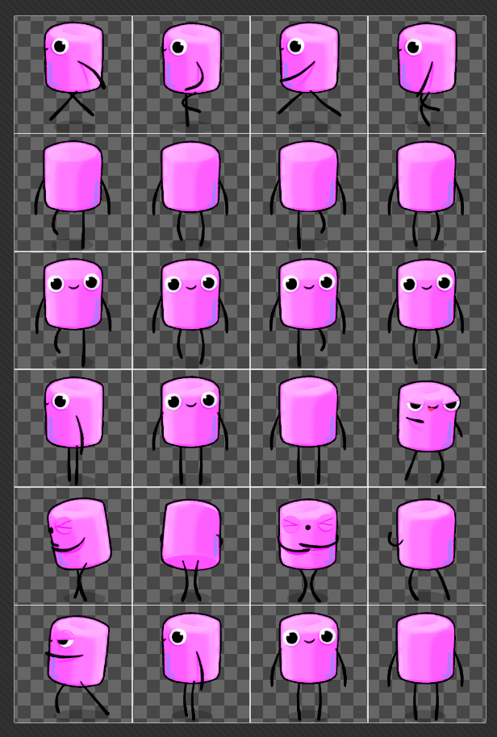
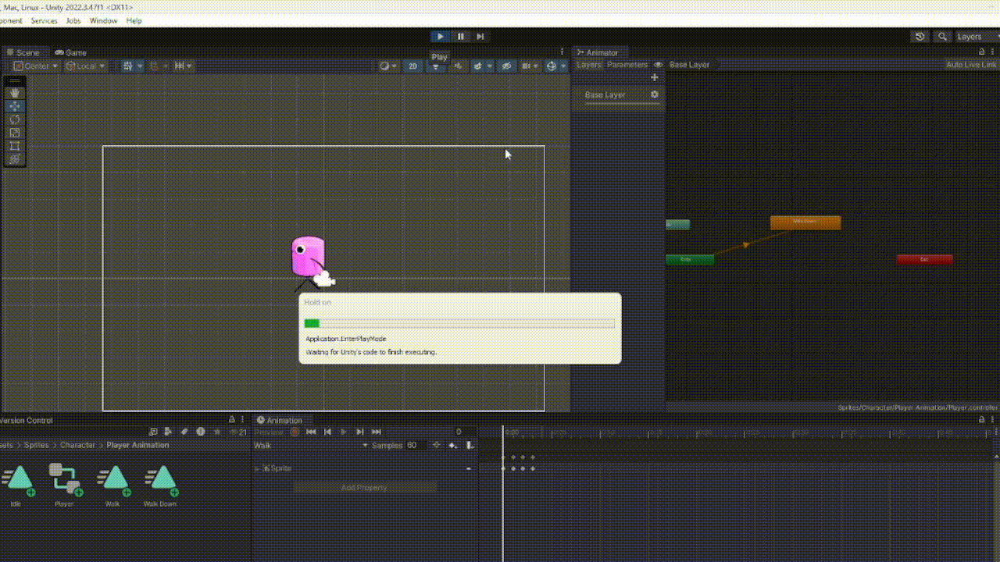
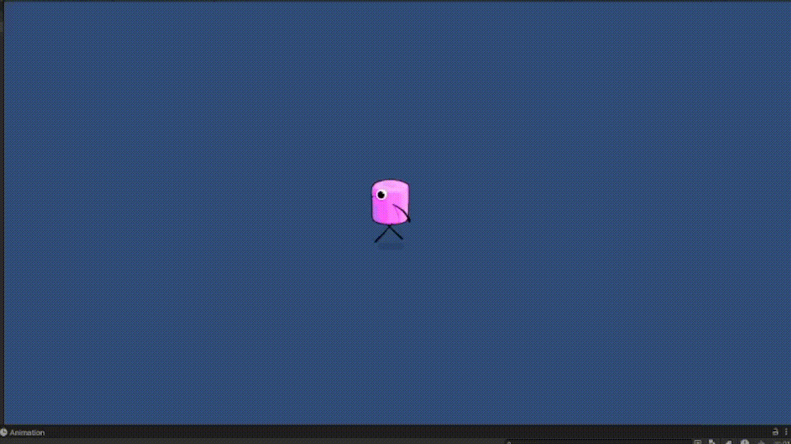
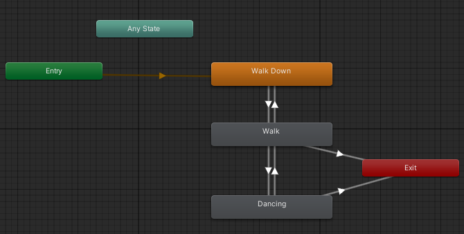

# Sprites

En está práctica se añaden sprites a un proyecto de Unity y estas sprites tienen que estar animados.

## Actividad 1

En está primera actividad añadí al proyecto el personaje que aparece en la Figura 1. Tras añadirlo tuve que configurarlo como múltiple y subdivir el atlas de sprites en sprites independientes.



*Figura 1: Subdivisión del atlas de sprites del character*

## Actividad 2

Se crea un objeto 2D que representa al personaje y usando la pestaña ```animation``` se añade una nueva animación. Está animación se llama **Walk Down** y se van añadiendo los diferentes sprites que se van a ir cambiando a los pocos segundo para simular el movimiento del personaje.



*Figura 2: Ejecución de la animación "Walk Down"*

## Actividad 3

En está actividad se creo el siguiente script para que el jugador pueda mover al personaje de izquierda a derecha. 

Cuando el jugador presiona la tecla ```A``` el personaje se mueve a la izquierda y cuando el jugador presiona la tecla ```D``` el personaje se mueve a la derecha.

```cs
public class PlayerMovement : MonoBehaviour
{
    [SerializeField]
    private float speed;

    private Rigidbody2D body;

    void Start()
    {
        body = GetComponent<Rigidbody2D>();
    }

    void FixedUpdate()
    {
        Movement();
    }

    private void Movement()
    {
        float x = Input.GetAxis("Horizontal");
        body.position += new Vector2(x, 0) * Time.deltaTime * speed;
    }
}
```


*Figura 3: Añadir controles por movimiento al gameObject*



*Figura 4: Movimiento del jugador sin animación*

## Actividad 4

El personaje por defecto no puede girar el sprite cuando se mueve a la izquierda o a la derecha.

Para poder girar el sprite se obtiene el componente ```spriteRenderer``` y usando la propiedad **FlipX** se puede controlar el giro del sprite dependiendo hacia donde se mueve.

```cs
public class PlayerMovement : MonoBehaviour
{
    [SerializeField]
    private float speed;

    private Rigidbody2D body;
    private SpriteRenderer spriteRenderer;

    void Start()
    {
        body = GetComponent<Rigidbody2D>();
        spriteRenderer
         = GetComponent<SpriteRenderer>();
    }

    // Update is called once per frame
    void FixedUpdate()
    {
        Movement();
    }

    private void Movement()
    {
        float x = Input.GetAxis("Horizontal");

        if (x > 0)
        {
            spriteRenderer.flipX = true;
        }
        else if (x < 0)
        {

            spriteRenderer.flipX = false;
        }

        body.position += new Vector2(x, 0) * Time.deltaTime * speed;
    }
}
```

## Actividad 5

En está actividad se utiliza el componente ```Animator``` y la propiedad **setBool()** para poder activar y desactivar la animación usando un condicional u otro tipo de evento.

```cs
public class PlayerMovement : MonoBehaviour
{
    [SerializeField]
    private float speed;

    [SerializeField]
    private float distanceToChangeAnimation = 10.0f;

    private Rigidbody2D body;
    private SpriteRenderer spriteRenderer;
    private Animator animator;

    private Vector2 previousPosition;
    private float distanceTraveled = 0.0f;


    void Start()
    {
        body = GetComponent<Rigidbody2D>();
        spriteRenderer = GetComponent<SpriteRenderer>();
        animator = GetComponent<Animator>();

        previousPosition = transform.position;
    }

    void FixedUpdate()
    {
        Movement();
        CalculateDistanceTraveled();
    }

    private void Movement()
    {
        float x = Input.GetAxis("Horizontal");

        if (x < 0 || x > 0)
            animator.SetBool("Walk", true);
        else
        {
            animator.SetBool("Walk", false);
        }

        if (x > 0)
        {
            spriteRenderer.flipX = true;
        }
        else if (x < 0)
        {
            spriteRenderer.flipX = false;
        }

        body.position += new Vector2(x, 0) * Time.deltaTime * speed;
    }

    private void CalculateDistanceTraveled()
    {
        float distance = Vector2.Distance(transform.position, previousPosition);
        distanceTraveled += distance;
        previousPosition = transform.position;

        if (distanceTraveled >= distanceToChangeAnimation)
        {
            animator.SetBool("Walk", false);
            animator.SetBool("Dance", true);

            distanceTraveled = 0.0f;
        }
    }
}
```

Para activar la animación de baile después de una cierta distancia recorrida hice lo siguiente. Cree la función ```CalculateDistanceTraveled()``` para calcular la distancia que ha recorrido el jugador y si se alcanza cierta distancia se desactiva la animación de caminar para activar la animación de baile.


*Figura 5: Animación de baile tras una distancia caminando*



*Figura 6: Nodos del animator*